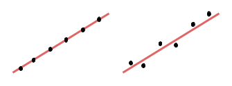
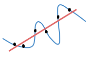
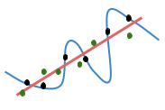
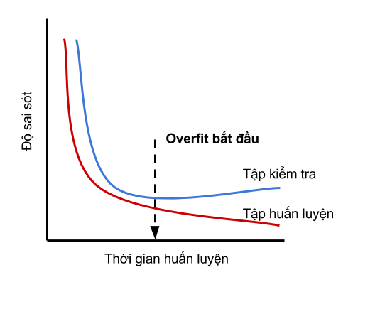

# Overfitting

Trong bài này, ta sẽ tìm hiểu kỹ hơn về training problem. Tại sao chỉ cần tìm model dự đoán "khá" chính xác trên training set? Tại sao một model dự đoán "hoàn toàn" chính xác trên training set lại có thể dự đoán rất tồi trên test set?

Khi nói đến training problem, không thể quên đi [objective function](https://ml-book-vn.khanhxnguyen.com/1_2_objective.html). Nhắc lại, objective function thường có dạng:

$$
objective = average\_loss + regularizer
$$

Theo ngôn ngữ toán học:

$$
\mathcal{L}_{D_{train}}(f_w) = \frac{1}{|D_{train}|}  \sum_{(x, y)\in D_{train}} L(f_w(x), y) + \lambda R(f_w)
$$

với $$\frac{1}{|D_{train}|} \sum_{(x, y)\in D_{train}} L(f_w(x), y)$$ là trung bình loss function trên training set, $$R(f_w)$$ là regularizer, $$\lambda$$ là regularization constant \(một [hyperparameter](https://ml-book-vn.khanhxnguyen.com/terms.html)\).

Mục tiêu của training là tìm ra model tối thiểu hóa objective function:

$$
w^* = \arg\min_{w} \mathcal{L}_{D_{train}}(w)
$$

Để rút gọn ký hiệu, khi model có dạng xác định, ta có thể sử dụng $$w$$ để chỉ model thay cho $$f_w$$.

Kí hiệu $$\arg\min_x f(x)$$ trả về giá trị của $$x$$ để hàm $$f(x)$$ đạt được giá trị cực tiểu. Ví dụ, $$\arg\min_x x^2 + 1 = 0$$ bởi vì $$x^2 + 1$$ đạt giá trị cực tiểu \(bằng 1\) tại $$x = 0$$. Các bạn sẽ nhìn thấy phương trình này trong đa số các paper \(bài báo khoa học\) về machine learning.

Khi ta nói muốn tìm model "dự đoán chính xác hoàn toàn" trên training set, tức là nói đến việc sử dụng một objective function mà không có regularizer:

$$
\mathcal{L}_{D_{train}}^{ERM}(f_w) = \frac{1}{|D_{train}|}  \sum_{(x, y)\in D_{train}} L(f_w(x), y)
$$

Đây được gọi là quy tắc **empirical risk minimization** \(ERM\). Ta sẽ giải thích vì sao nó được gọi như vậy. Loss function còn được gọi là risk function \(hàm rủi ro\). Chữ _empirical_ được thêm vào bởi vì risk function này được tính trung bình trên một tập dữ liệu hữu hạn. Vậy empirical risk minimization tức là **tối thiểu hóa rủi ro trên một tập dữ liệu hữu hạn**.

Bài viết này giới thiệu những kiến thức cần thiết để ta đưa ra được một thuật toán supervised learning tốt hơn ERM. Ta sẽ nói kỹ về vấn đề lớn nhất thường gặp phải khi sử dụng ERM, **overfitting**, và cách khắc phục nó. Overfitting là một trong những khái niệm quan trọng bậc nhất trong machine learning, là "bóng ma ám lấy machine learning".

## Occam's razor

Albert Einstein từng có một câu nói nổi tiếng là:

_Everything should be made as simple as possible, but no simpler._

Nghĩa là "mọi thứ nên được tối giản hóa hết mức có thể, nhưng không nên quá mức có thể". Trong machine learning, người ta thường nhắc đến một nguyên tắc gần tương tự gọi là \[Occam's razor\]\([https://en.wikipedia.org/wiki/Occam's\_razor](https://en.wikipedia.org/wiki/Occam's_razor)\):

_Entities must not be multiplied beyond necessity._ 

Áp dụng vào machine learning, nguyên tắc này được hiểu là:

_Trong tất cả các giả thiết có thể giải thích được một hiện tượng, ta nên chọn giả thiết đơn giản nhất._ 

Hoặc thậm chí đơn giản hơn:

**Trong tất cả các model "đúng", chọn model đơn giản nhất.**    

Lưu ý là ở đây có đến hai điều kiện cần được đảm bảo: giả thiết phải _đơn giản nhất_ nhưng vẫn phải _giải thích được hiện tượng_. Rất dễ để áp dụng Occam's razor một cách sai lầm.

Ta xét bài toán phân loại thư vào hai loại label, spam và không spam. Model đơn giản nhất có thể nghĩ ra đó là random một trong hai label với mỗi bức thư. Model này dù tối giản nhưng lại vô dụng và vi phạm Occam's razor vì nó không thể giải thích tính chất spam.

Trong một ví dụ khác như trong hình sau,

Chọn một đa thức bậc cao phức tạp để "giải thích" \(đi qua hết\) các điểm màu đen cũng vi phạm Occam's razor bởi vì giả thiết được chọn không phải đơn giản nhất. Thực chất ta chỉ cần một đa thức bậc một đơn giản \(đường thẳng đỏ\) để "giải thích" được các điểm này.

## Noise

Với supervised learning, cho dù có tồn tại một hàm bí ẩn $$f^*$$ sao cho mối quan hệ giữa label và observation là $$y = f^*(x)$$, thì dữ liệu trong thực tế cũng không bao giờ phản ánh chính xác được mối quan hệ này. Nguyên nhân gây ra điều này có thể là do sai số trong dụng cụ đo, hoặc đơn giản là do tự nhiên mang tính ngẫu nhiên. Ví dụ sau cho thấy thay vì thu được dữ liệu tuyến tính hoàn hảo \($$y = ax$$\) như hình bên trái thì thường tọa độ của các điểm dữ liệu sẽ bị sai lệch như hình bên phải.

Với một cặp dữ liệu $$(x, y)$$, ta có thể mô tả quá trình biến dạng của nó như sau:

$$
\tilde{x} = x + \epsilon_x
$$

$$
\tilde{y} = f(\tilde{x}) + \epsilon_y
$$

Cuối cùng, dữ liệu thật sự ta nhận được để huấn luyện và kiểm tra model là $$(\tilde{x}, \tilde{y})$$, phiên bản lỗi của $$(x, y)$$. $$\epsilon_x$$ và $$\epsilon_y$$ được gọi là **noise** của $$x$$ và $$y$$. Noise thường được xem là một biến số ngẫu nhiên \(random variable\), thay đổi tùy theo từng cặp $$(x, y)$$.

Sự xuất hiện của noise làm cho mối quan hệ giữa observation và label trở nên phức tạp hơn quan hệ thực sự giữa chúng. Đối với ví dụ ở trên, thì noise đã biến một quan hệ tuyến tính thành một quan hệ phức tạp hơn \(đường xanh dương\) mà một đa thức tuyến tính \(bậc một\) không thể giải thích nổi nữa mà cần đến một đa thức bậc cao hơn:

Noise không trực tiếp gây ra overfitting nhưng nó lại làm cho overfitting trở nên gây hại. Về bản chất, **overfitting là do model cố gắng giải thích tất cả các điểm dữ liệu nhìn thấy**. Điều này không gì khác chính là tuân theo ERM một cách tuyệt đối để dự đoán đúng tất cả các observation của training set. Nếu làm thế, trong quá hình huấn luyện, noise sẽ "lừa" model học một hàm số hoàn toàn sai so với bản chất của dữ liệu.

Khi các điểm dữ liệu của test set xuất hiện, vì noise thường không quá lớn, các điểm mới này cũng vẫn thể hiện phần lớn quan hệ tuyến tính và chỉ hơi lệch với đường thẳng đỏ mà thôi.

Trong trường hợp này, nếu áp dụng ERM ta sẽ chọn đường xanh dương thay vì đường thẳng đỏ vì đường thẳng xanh dương cho sai số thấp hơn trên các điểm dữ liệu của training set \(các điểm đen\). Nhưng một model phức tạp như đường thẳng xanh dương lại cho sai sót rất lớn trên các điểm dữ liệu của test set \(ta thấy các điểm xanh lá cây nằm rất xa so với đường xanh dương\). Vì sai sót trên test set mới là thứ ta quan tâm sau cùng nên điều này rất tệ. Ngược lại, nếu chọn model đơn giản như hơn đường thẳng đỏ và chấp nhận sai sót một ít trên tập huấn luyện, sai sót trên test set sẽ nhỏ hơn nhiều.

Qua ví dụ này, ta thấy là khi áp dụng Occam's razor vào machine learning, ta không thể tuân thủ nó quá một cách chặt chẽ. Sự xuất hiện của noise làm cho hai tiêu chuẩn của Occam's razor rất khó được bảo toàn: để giải thích được đúng hơn tập huấn luyện vốn chứa noise, ta buộc phải tăng độ phức tạp của model, và ngược lại. Vì thế, điều ta cần làm là cân bằng giữa hai điều kiện, đưa model gần với Occam's razor nhất có thể: chọn một model đơn giản vừa phải và giải thích được hiện tượng tương đối đúng.

Đến đây, ta đã hiểu tại sao chỉ cần model dự đoán "khá" chính xác trên training set rồi phải không nào.

## Overfitting

Qua phân tích ở phần trên, chắc các bạn cũng hiểu nôm na overfitting là khi ta quá cố gắng tối thiểu hóa objective function $$\mathcal{L}_{D_{train}}(w)$$ nhưng điều đó lại làm cho evaluation function $$\mathcal{L}_{D_{test}}(w)$$ lớn. Trong phần này, mình sẽ giới thiệu định nghĩa về overfitting mà mình quen thuộc nhất. Nhưng trước hết, ta cần một định nghĩa về evaluation function trên một tập dữ liệu vô hạn:

$$
\mathcal{L}_{\mathcal{D}}(w) = \mathbb{E}_{(x, y) \sim \mathcal{D}} \left[ L \left( f_w(x), y \right)  \right] =\sum_{(x, y)} L \left( f_w(x), y \right) \mathcal{D}(x, y)
$$

$$\mathcal{D}$$ ở đây không phải là một tập dữ liệu mà là một phân bố xác suất lên các cặp dữ liệu $$(x, y)$$, với $$\mathcal{D}(x, y)$$ là xác suất xuất hiện của cặp $$(x, y)$$. Khi nói về một tập dữ liệu "vô hạn", ta ám chỉ đến việc liên tục lấy các mẫu $$(x, y)$$ từ phân bố $$\mathcal{D}$$. Với các bạn chưa quen thuộc khái niệm này, mình sẽ minh họa bằng ví dụ đơn giản sau:

_Giả sử ta có một phân bố xác suất về sấp ngửa của một đồng xu như sau: 60% ngửa và 40% sấp. Muốn lấy một mẫu từ phân bố này, ta ngẫu nhiên chọn một số thực trong đoạn $\[0, 1\)$, tạm gọi là_ $$r$$_. Nếu_ $$r \leq 0.6$$_, ta chọn mẫu là ngửa, ngược lại ta chọn mẫu là sấp. Lặp lại quá trình này vô hạn lần, ta được một tập dữ liệu vô hạn gồm các mẫu sấp/ngửa._

Ký hiệu $$\mathbb{E}_{x \sim P} \left[ f(x) \right]$$ được gọi là **kỳ vọng** \(expectation\) của hàm $$f(x)$$ với $$x$$ được lấy mẫu từ phân bố $$P$$. Kỳ vọng đơn giản là phép tính trung bình cộng trên tập vô hạn. Ta thấy là định nghĩa evaluation function trên tập vô hạn thật ra không khác gì mấy so với định nghĩa evaluation function trên tập hữu hạn; ta chỉ thay phép trung bình cộng trên tập hữu hạn thành kỳ vọng.

Giảm thiểu $$\mathcal{L}_{\mathcal{D}}(w)$$ là mục đích tối thượng của supervised learning. Ta dùng $$\mathcal{L}_{D_{test}}(w)$$ để ước lượng $$\mathcal{L}_{\mathcal{D}}(w)$$ vì trong thực tế ta không thể nào có nguồn dữ liệu vô hạn.

Đến đây, ta định nghĩa overfitting là khi:

**Model quá tập trung vào việc đoán đúng hết tất cả các điểm dữ liệu của training set, nhưng việc đó lại làm giảm khả năng dự đoán của nó trên test set. Nói cách khác, overfitting là khi** $$\mathcal{L}_{D_{train}}(w)$$ **nhỏ nhưng** $$\mathcal{L}_{\mathcal{D}}(w) -\mathcal{L}_{D_{train}}(w)$$ **lớn.**

## Chuẩn đoán overfitting

Trong định nghĩa trên, thế nào được xem là "lớn" thì tùy thuộc vào từng ứng dụng khác nhau. Hơn nữa, ta cũng không thể nào tính được $$\mathcal{L}_{\mathcal{D}}$$ nên cũng không thể dựa vào định nghĩa đó để chuẩn đoán xem model có bị overfitting hay không. Trong thực tế, ta dùng $$\mathcal{L}_{D_{test}}$$ thay cho $$\mathcal{L}_{\mathcal{D}}$$. Để phát hiện overfitting, ta cần theo dõi **learning curve**, một biểu đồ thể hiện sự biến động của $$\mathcal{L}_{D_{train}}$$ và $$\mathcal{L}_{D_{test}}$$ trong suốt thời gian huấn luyện. Cứ sau một khoảng thời gian, ta ghi lại giá trị của $$\mathcal{L}_{D_{train}}$$ và $$\mathcal{L}_{D_{test}}$$ và vẽ biểu đồ của chúng theo thời gian, ta được learning curve.

Hình ở trên minh hoạ learning curve khi xuất hiện overfitting. Có vài điểm đáng chú ý sau:

1. Nếu ta áp dụng một phương pháp tối ưu hàm số hiệu quả, $$\mathcal{L}_{D_{train}}$$ \(đường đỏ\) sẽ giảm theo thời gian.
2. Ngược lại, $$\mathcal{L}_{D_{test}}$$ \(đường xanh\) không phải lúc nào cũng giảm. Nếu model bị overfitting, đến một lúc nào đó, gía trị này bắt đầu tăng trở lại.
3. Thời điểm mà $$\mathcal{L}_{D_{test}}$$ bắt đầu có xu hướng tăng được xem thời điểm bắt đầu overfitting. Vì sao? Vì sau đó, việc huấn luyện sẽ làm model dự đoán ngày càng tốt hơn trên training set, nhưng lại cho sai sót ngày càng nhiều trên test set.

Cách chuẩn đoán này cũng gợi ý cho ta cách làm đơn giản nhất để giảm thiểu overfitting, đó là **dừng huấn luyện ngay tại thời điểm bắt đầu overfitting**. Phương pháp này được gọi là **early stopping** \(dừng sớm\). Early stopping có tác dụng ngăn không cho khoảng cách giữa $$\mathcal{L}_{D_{train}}$$ và $$\mathcal{L}_{D_{test}}$$ tăng lên thêm. Để rút ngắn khoảng cách này hơn nữa, ta cần **sử dụng regularizer**, sẽ được nói đến ở bài sau.

Mình muốn kết thúc phần này bằng việc nhấn mạnh lại tầm quan trọng của overfitting: **nếu không có overfitting thì machine learning không thể được xem như một ngành nghiên cứu riêng biệt**, bởi vì khi đó ta chỉ cần vận dụng hết mọi công cụ tối ưu hàm số của toán học để giảm empirical risk về mức tối đa. Overfitting thể hiện trở ngại khi ta cố gắng bắt máy tính mô phỏng khả năng của con người: làm thế nào mà một người có thể tổng quát được những kiến thức đã học và áp dụng để xử lý tình huống chưa từng gặp, thậm chí là còn sáng tạo ra những thứ chưa hề tồn tại?

